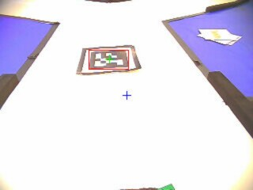

# 上海交通大学 AuTop 第16届智能车智能视觉组   Openart代码

本代码是上海交通大学AuTop第16届智能车智能视觉组的Openart代码部分，主要完成三叉路口数字识别、Apriltag的识别以及动物水果的分类打靶，包含我们训练的模型及相关代码，可直接在Openart端执行。

我们已将AuTop采用的处理方案进行详细开源讲解，知乎链接：https://zhuanlan.zhihu.com/p/391252945 （更新中）

---
##效果图

### 1.三叉识别
AuTop采用的方案是，基于全局分类器的设计思想，识别到三叉后完全不需停车，且准确率极高。在识别到三叉路口后，取160×60的方框为ROI，使用训练好的分类模型直接对这一区域进行分类识别。模型的运行时间仅为100ms左右，即便以3m/s的速度也可以及时得到判断结果。经过测试，在直道紧接三叉路口的路况上，完全不用减速，在90°弯道接三叉的路况上，仅需微踩刹车也不需停车。
识别效果图如下所示：

### 2.Apriltag识别
Apriltag的识别，可直接根据Openart的find_apriltags()函数完成，很难有优化的空间。最大的问题在于Apriltag的帧率，20Fps左右的帧率使得高速高糊状态下很难识别，因而需要使用总钻风提前判断Apriltag（黑斑）的出现，提前降速等待识别。
识别效果图如下所示：

### 3.水果动物识别
逐飞提供的水果动物的识别与数字识别类似，即找框加分类。这一方案改动空间并不大，我们最终也是采用了这一基本思路。

针对找矩形这一易扰因素，可以考虑提前根据一些因素对目标进行筛选，例如最小长宽、长宽比、指定ROI、矩形与外接矩形的角度偏差等等，这些思路都可以滤去大多的杂乱矩形，只留下需要分类的靶标，可以极快加速模型的运行。

识别效果图如下所示：

---
如果觉得我们的识别方案及模型思路对你有帮助，请点个STAR!